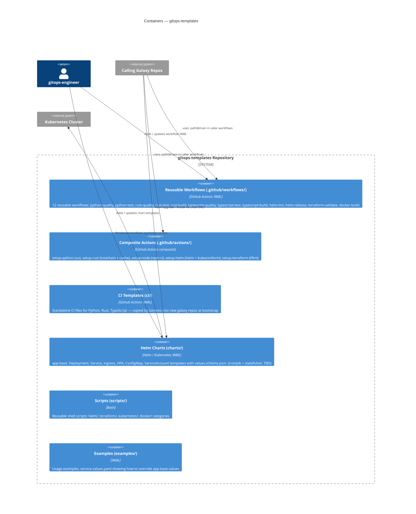

# Containers — gitops-templates

## Description
The repository is structured as a library with no runtime process of its own. Reusable workflows and composite actions are invoked by calling galaxy repos at CI time. Helm charts are either referenced directly or packaged by the helm-release workflow and published for consumption.
