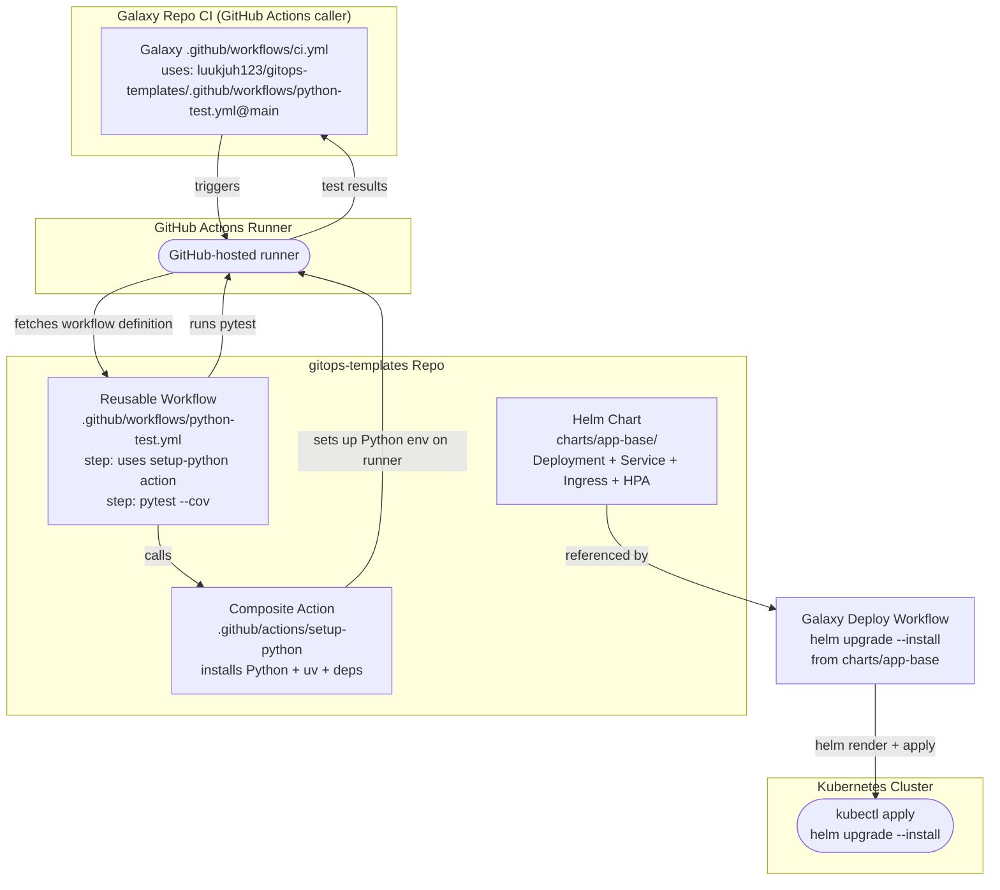

# Data Flow — gitops-templates

## Description
The data flow is pull-based: galaxy CI workflows reference gitops-templates by path at a specific git ref (`@main`). GitHub Actions fetches the referenced workflow/action definition and executes it on the runner. Helm charts are consumed by galaxy deploy jobs which render values against the base chart and apply to Kubernetes.
