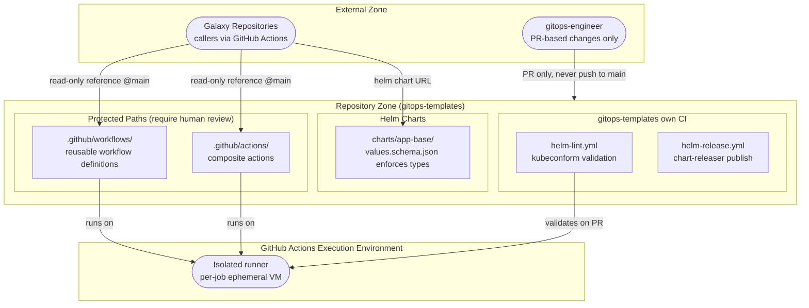

# Security Boundaries — gitops-templates

## Trust Zones
- **Repository**: gitops-templates is a trusted template source. Changes require PRs — direct pushes to main are blocked. Workflow and action changes have significant blast radius across all galaxies.
- **GitHub Actions runners**: Ephemeral, isolated per-job VMs. Galaxy secrets (KUBECONFIG, registry credentials) are injected by the caller repo — gitops-templates never holds galaxy secrets.
- **Helm charts**: `values.schema.json` enforces types and required fields, preventing misconfigured deployments.

## Authentication Points
- Repository write access: enforced via GitHub branch protection (PR + CI required)
- Galaxy secrets (e.g. `KUBECONFIG`, `DOCKER_PASSWORD`): held by each galaxy repo, passed as `secrets:` inputs to reusable workflows — never stored in gitops-templates
- Chart Releaser: GitHub token with repo permissions (auto-provided by GitHub Actions)

## Secrets / Credentials
- No secrets stored in this repository
- Callers pass their own registry credentials, kubeconfig, and cloud credentials as workflow inputs/secrets
- `.safety-policy.yml` defines allowed/blocked Python packages for galaxy security scanning
