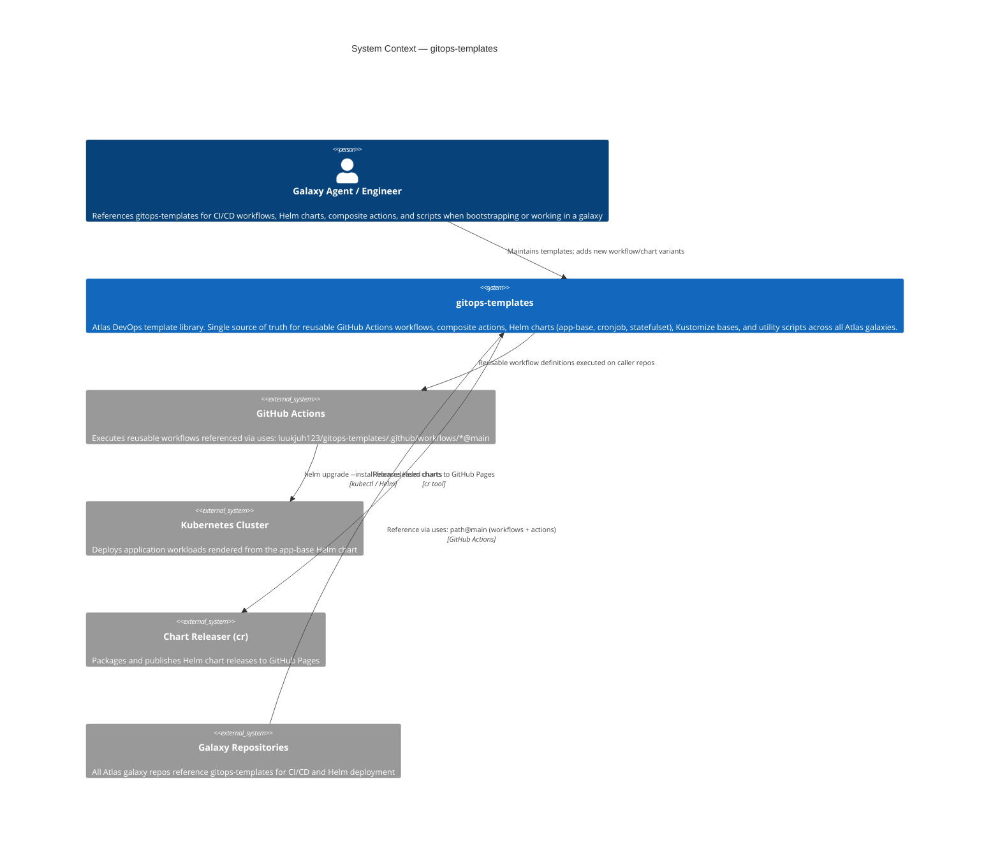

# System Context — gitops-templates

## Description
gitops-templates is a shared library repository. It is not deployed itself — galaxies pull from it at CI/CD runtime. The Helm charts it contains are consumed by galaxy deployment workflows and applied to Kubernetes clusters.
